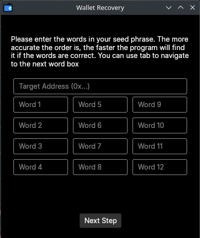

# MetaMask Seed Recovery Tool (previously MetaMask Seed Unscrambler)

## V3 is here!
A much more refined UI and more efficient algorythm have been bundled into v3. Have an issue with it or find a bug? Open up an Issue and I'll take a look as soon as I can.

## Building
`dotnet publish -r <RID> -p:PublishSingleFile=true --self-contained true`

Note: It is not necessary to build with `--self-contained true` if you plan to run the application on the machine you are building from - you already have the .NET Core SDK installed.

Runtime identifiers targets are available at https://learn.microsoft.com/en-us/dotnet/core/rid-catalog

## Usage
Launch the executable. Documentation on usage is within the GUI.

## Problems
If you experience an issue with running the application, first try to build from source yourself. If that doesn't work and you still have a problem or suggestion then please open a new Issue

## Contributing
Conributors are welcome! If you would like to contribute, open up a pull request and I will do my best to review and respond in a timely manor.

## Donations
### Am I required to donate?
Any donations to support my work are greatly appreciated but not a requirement of using this application. If it helps you, don't hesitate to let me know! You can contact me on Discord @ EthanR.
### Address for optional donations
0xeDEEB0EF2F166a8Db85BC18D0eD9F1022587171A